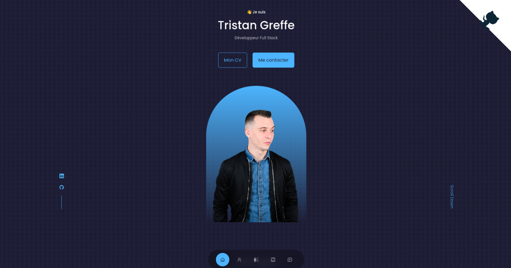

<div align="center">

  

  <p>My personal portfolio created with React.js</p>

  <p>
    <a href="https://github.com/tristan-greffe/portfolio">
      
    </a>
    <a href="https://github.com/tristan-greffe/portfolio/stargazers">
      
    </a>
    <a href="https://github.com/tristan-greffe/portfolio/blob/master/LICENSE">
      
    </a>
  </p>

 <h4>
    <a href="https://tristan-greffe.github.io/portfolio/">View Demo</a>
    <span> · </span>
    <a href="https://github.com/tristan-greffe/portfolio/issues/">Report Bug</a>
    <span> · </span>
    <a href="https://github.com/tristan-greffe/portfolio/issues/">Request Feature</a>
  </h4>

</div>

## About the Project

<div align="center">
  
</div>

### Folder Structure

Here is the folder structure of Portfolio.
```bash
|- public/
|- src/
  |-- assets/
  |-- components/
  |-- App.jsx
  |-- index.css
  |-- index.js
|- package.json
```

### Tech Stack

[](https://skillicons.dev)

## Getting Started

#### Step 1:

At the main folder execute the following command in console to get the required dependencies:

```bash
  npm install
```
or
```bash
  yarn install
```

#### Step 2:

At the main folder execute the following command in console to run the development server:

```bash
  npm run dev
```
or
```bash
  yarn dev
```

## Contributing

Contributions are always welcome!

Contributions are what make the open source community such an amazing place to learn, inspire, and create. Any contributions you make are **greatly appreciated**.

If you have a suggestion that would make this better, please fork the repo and create a pull request. You can also simply open an issue with the tag "enhancement".
Don't forget to give the project a star! Thanks again!

1. Fork it! 🤙

2. Create your feature branch: `git checkout -b my-new-feature`

3. Commit your changes: `git commit -m "Add some feature"`

4. Push to the branch: `git push origin my-new-feature`

5. Submit a pull request 👍

## License

This project is licensed under the MIT License - see the [license file](./LICENSE) for details
