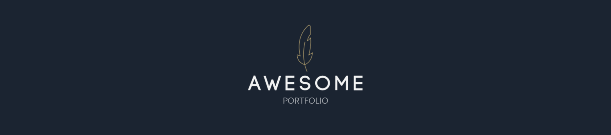
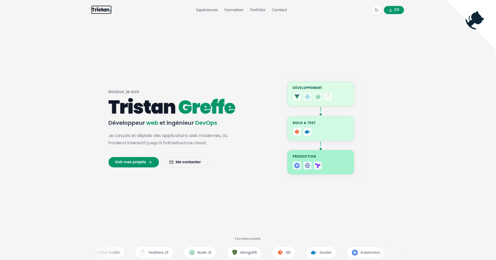

<div align="center">

  

  <h1>Personal portfolio - Web Developer & DevOps Engineer</h1>

  <p>
    <a href="https://github.com/tristan-greffe/portfolio/stargazers">
      
    </a>
    <a href="https://github.com/tristan-greffe/portfolio/blob/master/LICENSE">
      
    </a>
    <a href="https://tristan-greffe.github.io/portfolio">
      
    </a>
  </p>

  <h4>
    <a href="https://tristan-greffe.github.io/portfolio">View Demo</a>
    <span> · </span>
    <a href="https://github.com/tristan-greffe/portfolio/issues/">Report Bug</a>
  </h4>

</div>

<div align="center">
  
</div>

## Tech Stack

[](https://react.dev)
[](https://reactrouter.com)
[](https://www.framer.com/motion)
[](https://sass-lang.com)
[](https://www.emailjs.com)

## Getting Started

```bash
npm install
npm run dev      # dev server → http://localhost:3000
npm run build    # production build
npm run deploy   # build + deploy to GitHub Pages
```

## License

MIT - see [LICENSE](./LICENSE)
